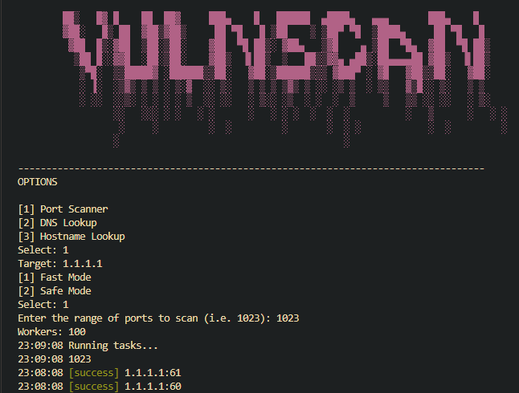

# VulnScan

A simple recon tool written in Go for basic network reconnaissance. This tool performs the following:

- Port Scanning (TCP 3-way handshake or SYN-only)
- DNS Lookup & IP Lookup
- Logging capabilities to `vulnScan.log`

## Example Usage


## Features
- **Port Scanning**: Check for open TCP ports using a 3-way handshake or SYN-only
- **IP Lookup**: Resolve domain names to IP addresses
- **DNS Lookup**: Perform DNS lookups to get information about domain names
- **Logging**: Logs activities and results to `vulnScan.log` for reviewing

## Installation

1. Ensure you have Go installed. If not, download and install it from [golang.org](https://golang.org).

2. Clone this repository:
   ```sh
   git clone https://github.com/xrlps/-VS.git